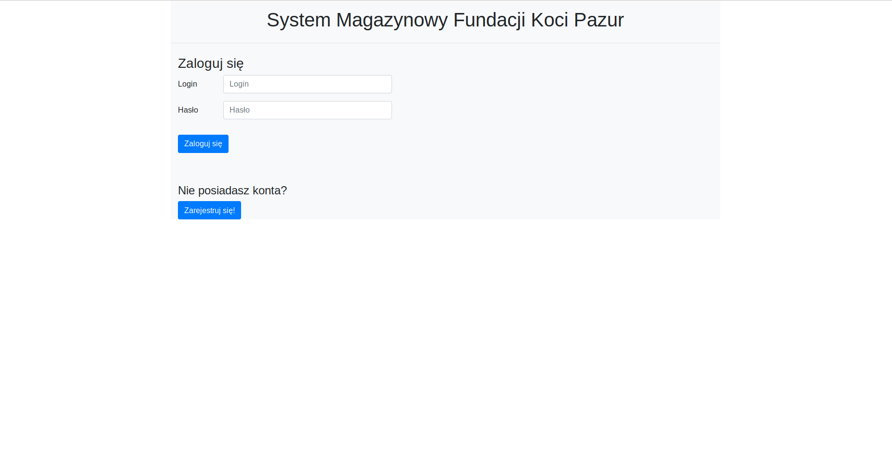
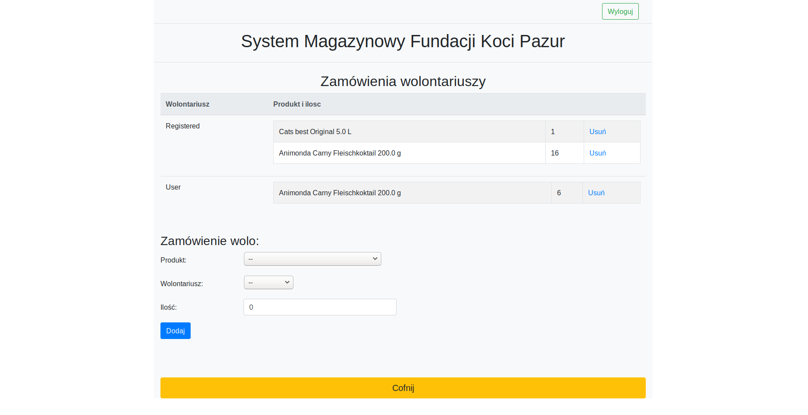

# Project title
Warehouse Management System for Foundation Koci Pazur in Poznan
# Motivation
Main motivation for this project was building a simply warehouse management system, that will help to control in easy way all of the supplies
and orders.

# Tech/framework used
* Maven 
* Spring MVC
* Spring Security
* Spring Test
* Spring Data
* JPA
* Hibernate 
* Lombok, 
* Thymeleaf 
* MySQL 

# Features
Service allow us to create products with their description that are stored in DB. In order to identify easily each product we can do it by 
product's barcode using barcode reader or when the product doesn't have assigned any barcode we can find product by its name.
Application includes also managing of the orders (receiving and spending) as well managing of the product that are reserve (also receiving and spending).
In oder to be able to use the service you have to be registered. In application there is administration panel, where we can assign roles for users. 

# Screenshots
* Login Page

* registered view

* user view

* admin view

* control panel products: screenshot 1

* control panel products: screenshot 2

* creating new order
